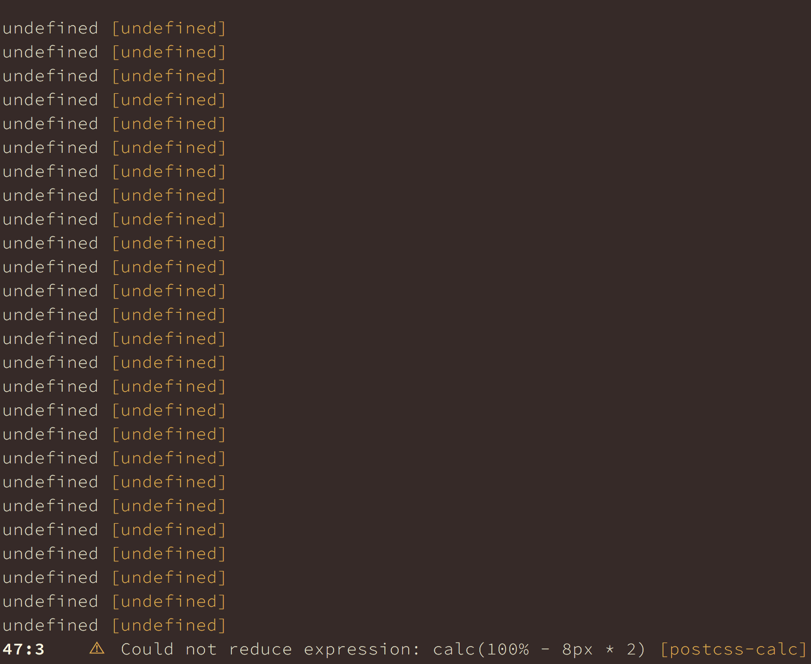

# postcss-reporter emits `undefined [undefined]` warnings

## Summary
When `postcss-import` and `postcss-calc` with `warnWhenCannotResolve` enabled are used, `postcss-reporter` starts to emit warnings saying `undefined [undefined]` in addition to valid ones `⚠  Could not reduce expression: ...`.

## Steps to reproduce

1. `git clone`
2. `yarn install`
3. `node index.js`

## Cause
There are separate two issues in `postcss-calc` and `postcss-reporter`.

The first `undefined` is due to `postcss-reporter`'s issue where it doesn't filter out messages that don't have `text` property. According to the [postcss API document](http://api.postcss.org/Result.html#messages), required properties of `Message` are only `type` and `plugin`. `postcss-import` indeed [pushes messages without `text` property](https://github.com/postcss/postcss-import/blob/f98dd1a5a6a987c8cf197db46644765a4d43d73a/index.js#L198-L205). `postcss-reporter`, however, [assumes each message has `text`](https://github.com/postcss/postcss-reporter/blob/f29e44b30aeb9931e7dfea4aceed0de4f851f864/lib/formatter.js#L68), causing `undefined` to be shown as a message body.

The second `undefined` is due to `postcss-import`'s issue where it doesn't set `plugin` property to their messages. As in the API documentation, the property is mandatory but [they don't have it](https://github.com/postcss/postcss-import/blob/f98dd1a5a6a987c8cf197db46644765a4d43d73a/index.js#L198-L205).
